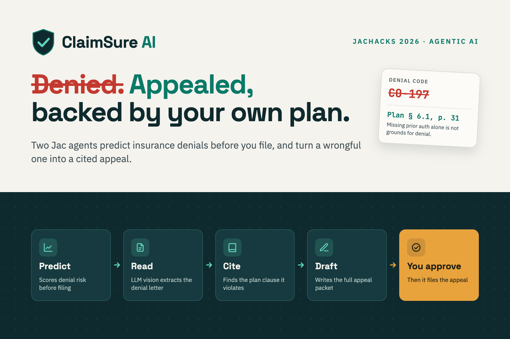
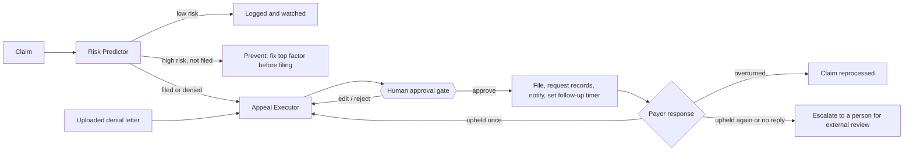

# ClaimSureAI

**Predicts health insurance denials, and fights the wrongful ones for you.**

<p align="center">
  
</p>

ClaimSureAI is an agentic claims advocate built entirely in [Jac](https://www.jaseci.org/). Two AI agents share one knowledge graph: the **Risk Predictor** flags risky claims before they are filed, and the **Appeal Executor** reads a denial letter, finds the plan clause it contradicts, and prepares a cited appeal. A person approves every consequential step.

> **AI can prepare the case, but people remain in control of the decision.**

Built for **JacHacks 2026 · Agentic AI track**.

---

## Inspiration

Insurance denials can be overwhelming. A denial letter just says **CO-197**. Few people know that means *"prior authorization absent"*, or that the rule that could overturn it is buried deep in a plan document almost nobody reads. Add a cover letter, a medical necessity note, records requests and a filing deadline, and most people give up, even when their own plan is on their side.

We wanted to turn that experience into a clear, guided path forward.

## What it does

ClaimSureAI helps **before and after** an insurance denial:

- **Before filing:** it predicts denial risk from similar historical claims and explains the factors behind it, so you can fix a problem (such as missing prior authorization) before it becomes a denial.
- **After a denial:** it reads the denial letter, matches it to a specific plan clause (section and page), decides whether the denial looks wrongful, and drafts a complete, evidence-backed appeal packet.
- **After you approve:** it files the appeal, requests records, notifies the patient, and keeps following up. It re-appeals or escalates to a person if the payer does not budge.

---

## Agentic workflows

### Two agents, one knowledge graph



Both agents are Jac **walkers** that read and write the same object-spatial graph, so context is never lost when a case moves from prediction to appeal.

### Agent 1: Risk Predictor (before a denial)

1. **Assess.** It builds a feature vector for the claim (procedure category, payer, policy type, network status, prior authorization, documentation completeness) and runs a weighted nearest-neighbour search over a 72-claim history.
2. **Explain.** It ranks the factors driving the risk, explains each one in plain language with its historical denial rate, and shows the most similar past claims and their outcomes.
3. **Decide.** A decision gate routes the claim:

| Risk result | What the agent does |
|---|---|
| Low risk | Logs it and keeps watching the claim |
| High risk (55%+), not yet filed | **Prevent:** recommends fixing the top factor before filing |
| High risk, already filed, or denied | **Hands off** to the Appeal Executor so the packet is ready early |

### Agent 2: Appeal Executor (after a denial)

The Appeal Executor runs a **read → reason → act → follow up** loop:

| Step | What happens |
|---|---|
| **01 Read** | LLM vision (`by llm()`) turns a photo of the denial letter or EOB into typed fields plus a confidence score. The user reviews and corrects them. |
| **02 Check** | Confidence below 60%, or a denial code that isn't a recognized CARC code? It routes to manual review. **It never guesses.** |
| **03 Ground** | It matches the denial code and claim details to a plan clause and cites its section and page. |
| **04 Decide** | It classifies the denial as *wrongful* or *legitimate* from the reason code, clause strength and similar past appeals. Legitimate-looking denials pause for a person to decide. |
| **05 Draft** | It writes the cover letter, medical necessity note, provider records request and attachment checklist, citing the clause verbatim. |
| **06 You approve** | The workflow stops at **Awaiting your approval**. Edit, reject, or approve. Nothing is sent before this. |
| **07 Act & track** | It submits to the payer, requests records, prepares a fax packet, notifies the patient and sets a 30-day follow-up timer *(all simulated in the demo)*. |

**It keeps going after filing.** If the payer upholds the denial, the agent prepares a second-level appeal and waits for approval again. If the denial is upheld a second time, or the follow-up date passes with no reply, it escalates to a person for external review or the state insurance ombudsman.

---

## Autonomous where it's safe, human where it matters

| Guardrail | How it works |
|---|---|
| **Never guesses** | Low-confidence scans, unknown denial codes and denials that look legitimate go to a person instead of being pushed forward. |
| **Shows its evidence** | Every risk score lists ranked factors and the nearest historical claims. Every appeal quotes the plan clause with its section and page. |
| **Human approval gate** | Nothing reaches the payer, provider or patient until a person approves, edits or rejects the packet. |
| **Every step audited** | Each sub-agent (Risk predictor, Policy matcher, Classifier, Document assembler, Dispatcher, Tracker) logs what it did, when, and on what evidence. |
| **Degrades gracefully** | If no model key is set or an LLM call fails, it falls back to deterministic extraction and a clause-citing template, so the workflow never breaks. |

---

## How we built it

ClaimSureAI is written in **Jac from graph to UI**. About **97% of the codebase is Jac** (4,681 lines). The rest is 129 lines of CSS, with no Python or JavaScript source files.

| Jac feature | How ClaimSureAI uses it |
|---|---|
| `node` + edges (Object-Spatial Programming) | Shared memory: `Patient`, `Claim`, `Policy`, `PolicyClause`, `Provider`, `DenialHistory`, `AppealCase`, `AuditEntry`, persisted automatically |
| `walker` + `spawn` | The two agents, `risk_predictor` and `appeal_executor`, spawn on `root` and travel to the claim or case they act on |
| `by llm()` + `sem` | Typed LLM calls that return `DenialExtraction` and `AppealDraft` objects, with no prompt glue or SDK |
| `def:pub` | 15 API endpoints with no routing code |
| `cl` + `sv import` | The React UI is written in Jac and calls the server with `await` |
| `impl` files | Agent declarations in `claims.jac`, logic in `claims.impl.jac` |

The agent really is a walker (shortened here):

```jac
walker appeal_executor {
    can execute with AppealCase entry {
        if here.ocr_confidence < 0.6 {
            # route to a person, never guess
            disengage;
        }
        _match_clause(claim, here);   # ground
        _classify(claim, here);       # decide
        _draft_packet(claim, here);   # act
        here.stage = "awaiting_approval";
    }
}

def llm_write_appeal(facts: str, clause_citation: str) -> AppealDraft
    by llm(temperature=0.2);
```

### Architecture

```text
main.jac                           client entry and routes
components/
  Dashboard.jac                    claim list, filters, upload entry
  ClaimIntake.jac                  risk-check form
  RiskDetail.jac                   score, factors, similar-claim evidence
  UploadDenial.jac                 file upload and editable extraction
  AppealTracker.jac                appeal timeline, packet, approval gate
  AuditLog.jac                     chronological evidence log
services/
  claims.jac                       graph schema, view models, walkers, endpoints
  claims.impl.jac                  scoring, clause matching, LLM calls + fallbacks, dispatch, audit
```

---

## Try the demo

The app seeds six claims that together cover every path the agents can take:

| Claim | What the agents do |
|---|---|
| Lumbar MRI, out-of-network, no prior auth | High risk and already filed: appeal prep starts early |
| Cardiac stress echo, in-network | Low risk: logged and watched |
| Knee arthroscopy, not yet filed | High risk: fix prior auth before filing |
| Migraine injection, denied CO-197 | Cited appeal drafted, paused for your approval |
| Glucose monitor, denied CO-50 | Appeal filed, and the payer overturned it |
| Physical therapy, denied CO-119 | Upheld twice: escalated to a person |

Suggested walkthrough: open the migraine claim, review the Section 6.1 citation at the approval gate, approve it, and watch the Dispatcher and Tracker entries appear in the audit log.

### Routes

| Route | Purpose |
|---|---|
| `/` | Dashboard: claim cards, filters, sorting, upload entry |
| `/claims/new` | New claim risk check |
| `/claims/:id/risk` | Risk prediction, factors, similar-claim evidence |
| `/upload` | Denial upload with editable extracted fields |
| `/appeals/:id` | Appeal steps, clause and packet review, approval, tracking |
| `/audit` | Reverse-chronological audit history |

### Run locally

With Jac 0.34.20 installed, from the project root:

```bash
jac install
jac start --dev main.jac
```

Open the URL printed by `jac start` (usually `http://localhost:8000`).

### Configure the LLM (optional)

`jac.toml` reads the model and key from the environment:

```toml
[byllm.model]
default_model = "${LLM_MODEL:-gemini/gemini-3.8-flash}"
api_key = "${GOOGLE_API_KEY:-}"
```

Set `GOOGLE_API_KEY` (and optionally `LLM_MODEL`) in your environment, or in JacHammer **Settings → Environment**, then restart. Without a key, the app runs on its deterministic fallbacks. Never commit API keys or put them in client code.

---

## Challenges we ran into

The biggest challenge was making the agent useful **without letting the AI make consequential decisions on its own**. That meant building explicit confidence checks, manual-review paths, approval gates and audit trails into the workflow itself. We also had to make every recommendation traceable to historical claims and specific policy clauses, rather than presenting unexplained AI output.

## Accomplishments that we're proud of

- **Prediction and advocacy in one continuous workflow.** Instead of stopping at "this claim might be denied," ClaimSureAI explains the risk, analyzes the denial, finds the supporting policy language and prepares the appeal.
- **A long-running agent, not a one-shot answer.** It tracks the payer's response, re-appeals and escalates.
- **One shared knowledge graph** for both agents, with humans explicitly in control of every consequential action.
- **Almost entirely Jac**, from the graph schema and agents to the API and UI.

## What we learned

Building AI agents for high-stakes domains is about much more than getting an LLM to produce a good answer. **Evidence, uncertainty, explainability and human oversight have to be part of the architecture itself.** Jac's graph-based approach showed us how a shared representation of domain entities makes complex multi-step agent workflows easier to reason about.

## What's next for ClaimSureAI

- Verified policy-document ingestion with citation validation
- Real claims (EDI 835/837) and EHR integrations
- Authentication, tenant isolation and production-grade privacy controls for PHI
- Calibrated, evaluated prediction models, including checks for bias and reliability
- Real payer, fax and deadline services, with every external action still explicitly authorized

We'll keep the principle at the core of ClaimSureAI: **AI can prepare the case, but people remain in control of the decision.**

---

## Limitations

This is a hackathon demonstration, **not medical, legal or insurance advice**.

- Patients, policies, providers, claim history and denial data are all synthetic. Plan clauses are illustrative.
- Risk prediction and wrongful-denial classification are demo heuristics, not a validated model.
- Payer submission, fax, email, notifications and timers are simulated and contact no one.
- Do not upload real patient data.
